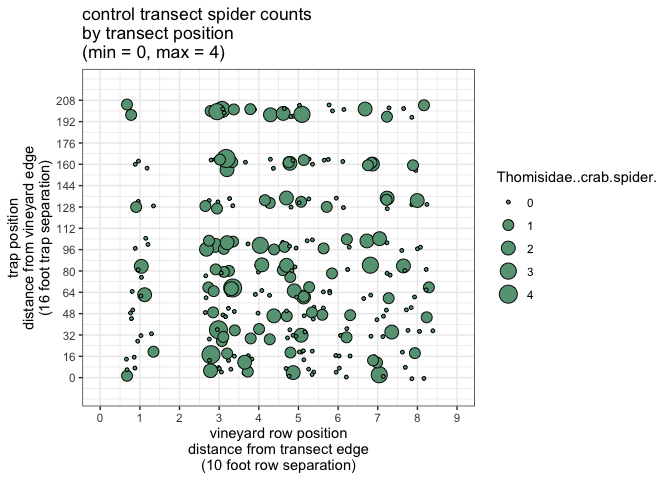
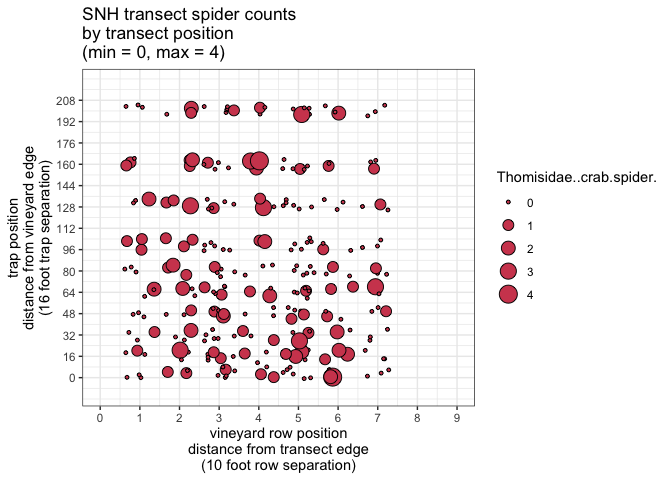
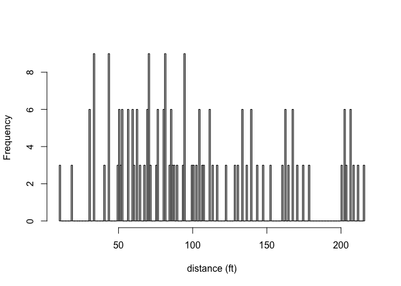
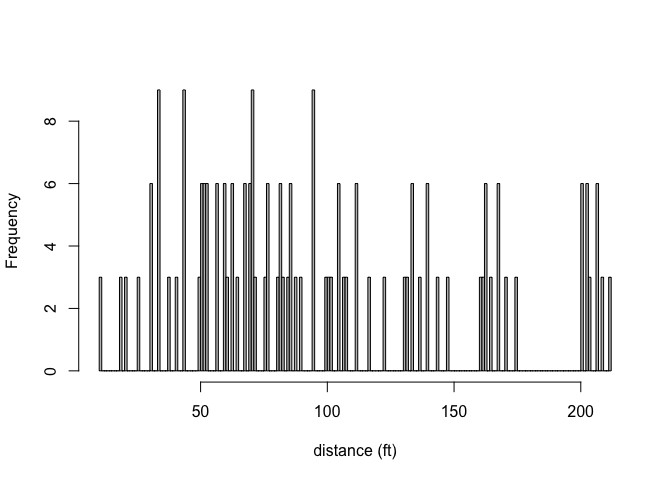
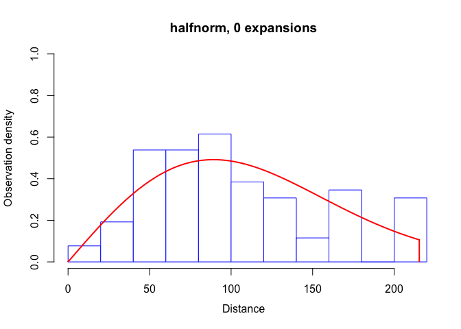
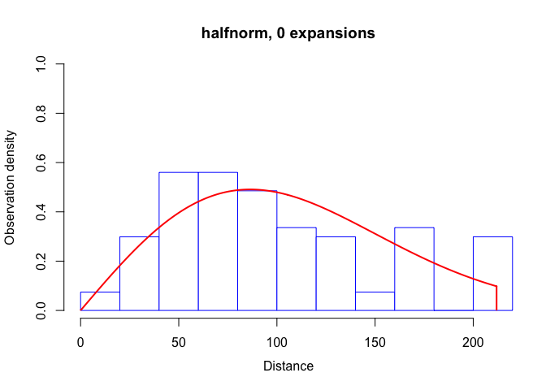

spider population density from point observations
================

**Abundance Estimate**

| Control Transect                 |           SNH Transect           |
| -------------------------------- | :------------------------------: |
| 0.9573448 spiders/sq-ft          |     0.9118289 spiders/sq-ft      |
| 95% CI=( 0.8170945 to 1.196123 ) | 95% CI=( 0.7399267 to 1.187072 ) |

diagnostics (below) from Beginner Point-Transect Analysis in Rdistance
(<https://cran.r-project.org/web/packages/Rdistance/vignettes/Rdistance_BeginnerPointTransects.pdf>)

For each method, the primary survey comprises a random sample of points,
or more usually a systematic grid of points, through the region of
interest. Animals are lured to a point, or trapped at a point, and the
number of animals observed at each point is recorded. A separate study
is conducted on a subset of animals, to record whether they respond to
the lure or enter the trap, for a range of known distances from the
point. These data are used to estimate the probability that an animal
will respond to the lure or enter the trap, as a function of its initial
distance from the point. This allows the counts to be converted to an
estimate of abundance in the survey region.
<https://besjournals.onlinelibrary.wiley.com/doi/full/10.1111/j.1365-2664.2006.01135.x#b4>

Point transect methods work well for many species, but some species are
insufficiently visible or noisy to allow adequate numbers of detections
by observers standing at random points. This has led to the development
of methods that combine trapping studies with point transect sampling.
The standard method for this is the trapping web (Anderson et al. 1983;
Lukacs, Franklin & Anderson 2004). A single web typically contains 90 or
more traps, which are arranged rather like a circular spider’s web, with
a higher density of traps at the centre than at the edges. Conceptually,
the point of the point transect is at the centre of the web, and
trapping density is sufficient to be certain of trapping any animals
located at or near the web centre.
<https://besjournals.onlinelibrary.wiley.com/doi/full/10.1111/j.1365-2664.2006.01135.x#b7>
\*
<https://besjournals.onlinelibrary.wiley.com/doi/full/10.1111/j.1365-2664.2006.01135.x#b19>
\*

A fundamental characteristic of distance-sampling analyses is that
sightability (probability of detection) of targets is assumed to decline
as off-transect distances increase. Targets far from the transect are
assumed to be harder to detect than targets close to the transect.
<https://github.com/tmcd82070/Rdistance/wiki/Basic-information-on-distance-sampling>

User-Defined Likelihood Functions in Rdistance
<https://cran.r-project.org/web/packages/Rdistance/vignettes/Rdistance_CustomDetectionFunction.pdf>

Distance software: design and analysis of distance sampling surveys for
estimating population size
<https://www.ncbi.nlm.nih.gov/pmc/articles/PMC2847204/>

Distance Sampling
<https://onlinelibrary.wiley.com/doi/abs/10.1002/0470011815.b2a16019>
